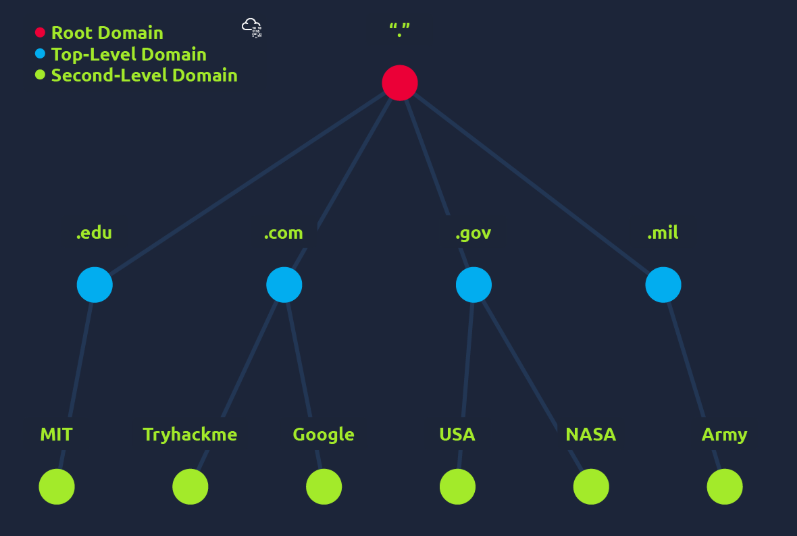
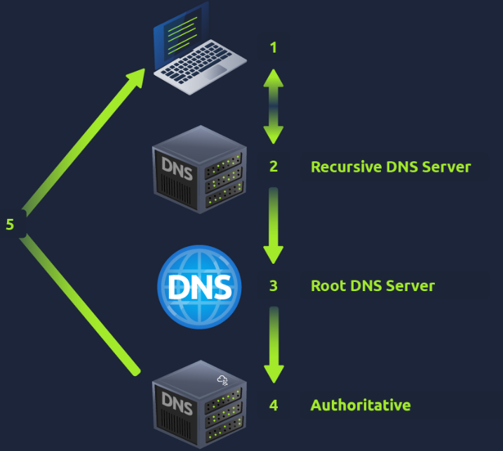
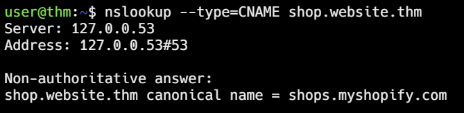
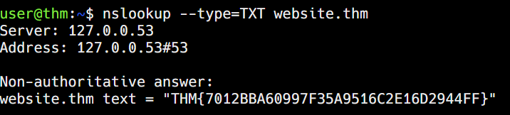
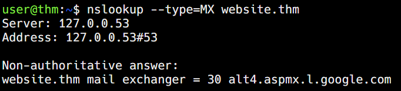
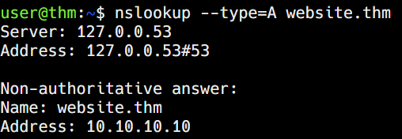

# DNS in detail

This room is part of the **How The Web Works** module available under the Pre-Security path.

You can access the room here: <a href="https://tryhackme.com/room/dnsindetail">DNS in detail</a>

## Task 1
* **DNS (Domain Name System)** provides a simple way for us to communicate with devices on the internet without remembering complex numbers.
* Every website on the internet has its own IP address which looks like this 104.26.10.229.
* When you want to visit a website, it's not exactly convenient to remember this set of numbers, and that's where DNS can help.

Q.) What does DNS stand for?

A.) **Domain Name System**

## Task 2 - Domain Hierarchy

### Top Level Domain (TLD)
* A TLD is the most righthand part of a domain name.
* So, in google.com, "**.com**" is the TLD.
* There are 2 types:-
  1. **Generic TLD (gTLD)** gives the purpose of a domain's name. **.com** means commercial purposes, **.org** means organization, **.edu** means education and **.gov** means government.
  2. **Country Code TLD (ccTLD)** gives the domain a geographical purpose. **.ca** for Canada, **.co.uk** for United Kingdom

### Second Level Domain
* In google.com, **google** is the Second Level Domain.
* It is limited to **63** **characters** + the TLD and can only use **a-z, 0–9 and hyphen**.

### Subdomain
* A subdomain sits on the left-hand side of the Second-Level Domain using a period to separate it.
* For example in admin.tryhackme.com, the **admin** part is the subdomain.
* A subdomain has the same creation restrictions as a Second Level Domain.
* You can use multiple subdomains, but the total length has to be kept to 253 characters or less.

Q.) What is the maximum length of a subdomain?

A.) **63**

Q.) Which of the following characters cannot be used in a subdomain ( 3 b _ - )?

A.) **_**

Q.) What is the maximum length of a domain name?

A.) **253**

Q.) What type of TLD is .co.uk?

A.) **ccTLD**

## Task 3 - Record Types
* There are multiple types of DNS records:-
  1. **A Record** - These records resolve to IPv4 addresses.
  2. **AAAA Record** - These records resolve to IPv6 address.
  3. **CNAME Record** - These records resolve to another domain.
  4. **MX Record** - These records resolve to the address of the servers that handle the email for the domain you are querying.
  5. **TXT Record** - TXT records are free text fields where any text-based data can be stored.

Q.) What type of record would be used to advise where to send email?

A.) **MX**

Q.) What type of record handles IPv6 addresses?

A.) **AAAA**

## Task 4 - Making a Request
1. When you request a domain name, your computer first checks its local cache to see if you've previously looked up the address recently; if not, a request to your Recursive DNS Server will be made.
2. A Recursive DNS Server is usually provided by your ISP, but you can also choose your own.
3. If a result is found locally, this is sent back to your computer, and your request ends here. If the request cannot be found locally, a journey begins to find the correct answer, starting with the internet's root DNS servers.
4. The root servers act as the DNS backbone of the internet; their job is to redirect you to the correct Top Level Domain Server, depending on your request.
5. The TLD server holds records for where to find the authoritative server to answer the DNS request. The authoritative server is often also known as the nameserver for the domain.
6. An authoritative DNS server is the server that is responsible for storing the DNS records for a particular domain name and where any updates to your domain name DNS records would be made.
7. Depending on the record type, the DNS record is then sent back to the Recursive DNS Server, where a local copy will be cached for future requests and then relayed back to the original client that made the request.
8. DNS records all come with a TTL (Time To Live) value. This value is a number represented in seconds that the response should be saved for locally until you have to look it up again. Caching saves on having to make a DNS request every time you communicate with a server.

Q.) What field specifies how long a DNS record should be cached for?

A.) **TTL**

Q.) What type of DNS Server is usually provided by your ISP?

A.) **Recursive**

Q.) What type of server holds all the records for a domain?

A.) **Authoritative**

## Task 5 - Practical
* In this lab, we will be making different types of queries

Q.) What is the CNAME of shop.website.thm?

A.) **shops.myshopify.com**

Q.) What is the value of the TXT record of website.thm?

A.) **THM{7012BBA60997F35A9516C2E1D2944FF}**

Q.) What is the numerical priority value for the MX record?

A.) **30**

Q.) What is the IP address for the A record of www.website.thm?

A.) **10.10.10.10**
