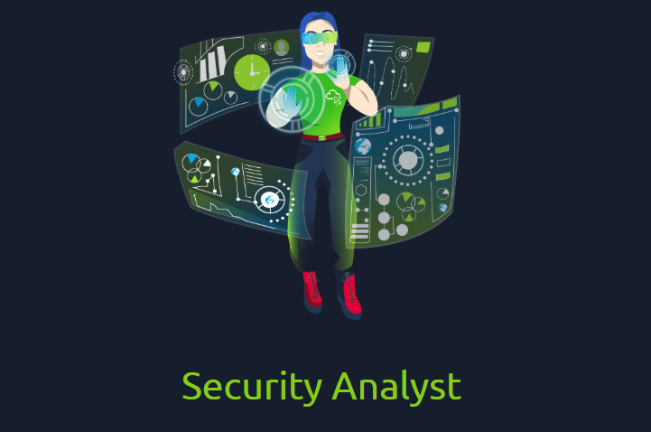

# Careers in Cyber
This room is part of the **Introduction to Cyber Security** module available under the Pre-Security path.

You can access the room here: <a href="https://tryhackme.com/room/careersincyber">Careers in Cyber</a>

## Task 1 - Introduction
Cyber security careers are becoming more in demand and offer high salaries. They are many different jobs within security industry, from offensive pentesting to defensive security.

This room helps you break into cyber security by providing information about various cyber security roles.

## Task 2 - Security Analyst
Security analysts are integral to constructing security measures across organizations to protect the company from attacks. Analysts explore and evaluate company networks to uncover actionable data and recommendations for engineers to develop preventative measures.

Responsibilities:
* Working with various stakeholders to analyze the cyber security throughout the company
* Compile ongoing reports about the safety of networks, documenting security issues and measures taken in response
* Develop security plans, incorporating research on new attack tools and trends, and measures needed across teams to maintain data security.

## Task 3 - Security Engineer
Security engineers develop and implement security solutions using threats and vulnerability data - often sourced from members of the security workforce. Security engineers work across circumventing a breadth of attacks, including web application attacks, network threats, and evolving trends and tactics.

Responsibilities:
* Testing and screening security measures across software
* Monitor networks and reports to update systems and mitigate vulnerabilities
* Identify and implement systems needed for optimal security

## Task 4 - Incident Responder
Incident responders respond productively and efficiently to security breaches. Responsibilities include creating plans, policies, and protocols for organizations to enact during and following incidents.

Responsibilities:
* Developing and adopting a thorough, actionable incident response plan
* Maintaining strong security best practices and supporting incident response measures
* Post-incident reporting and preparation for future attacks, considering learnings and adaptations to take from incidents

## Task 5 - Digital Forensics Examiner
If you like to play detective, this might be the perfect job. If you are working as part of a law-enforcement department, you would be focused on collecting and analyzing evidence to help solve crimes: charging the guilty and exonerating the innocent.

Responsibilities:
* Collect digital evidence while observing legal procedures
* Analyze digital evidence to find answers related to the case
* Document your findings and report on the case

## Task 6 - Malware Analyst
A malware analyst's work involves analyzing suspicious programs, discovering what they do and writing reports about their findings. A malware analyst is sometimes called a reverse-engineer as their core task revolves around converting compiled programs from machine language to readable code, usually in a low-level language.

Responsibilities:
* Carry out static analysis of malicious programs, which entails reverse-engineering
* Conduct dynamic analysis of malware samples by observing their activities in a controlled environment
* Document and report all the findings

## Task 7 - Penetration Tester
A penetration tester's job role is to test the security of the systems and software within a company - this is achieved through attempts to uncover flaws and vulnerabilities through systemized hacking. Penetration testers exploit these vulnerabilities to evaluate the risk in each instance.

Responsibilities:
* Conduct tests on computer systems, networks, and web-based applications
* Perform security assessments, audits, and analyze policies
* Evaluate and report on insights, recommending actions for attack prevention

## Task 8 - Red Teamer
This job role requires imitating cyber criminals' actions, emulating malicious attacks, retaining access, and avoiding detection. Red team assessments can run for up to a month, typically by a team external to the company.

Responsibilities:
* Emulate the role of a threat actor to uncover exploitable vulnerabilities, maintain access and avoid detection
* Assess organizations' security controls, threat intelligence, and incident response procedures
* Evaluate and report on insights, with actionable data for companies to avoid real-world instances

## Task 9 - Career Quiz
This room concludes with a behavioral quiz which tells you which role is the most suitable for you.

My suitable role - **Security Analyst**

Try it out for yourself and see what role you are most suitable for!!
