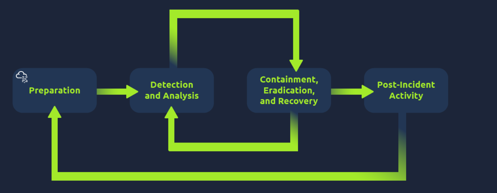

# Defensive Security Intro

This room is part of the **Introduction to Cyber Security** module available under the Pre-Security path.

You can access the room here: <a href="https://medium.com/r/?url=https%3A%2F%2Ftryhackme.com%2Froom%2Fdefensivesecurityintro">Defensive Security Intro</a>

## Task 1 - Introduction to Defensive Security
Defensive Security is concerned with 2 tasks:
* Preventing intrusions from occurring.
* Detecting intrusions when they occur and responding properly.

Blue teams are part of the defensive landscape.

Some of the tasks related to defensive security include:
* **User cyber security awareness**: Training users about cyber security helps protect against attacks targeting their systems.
* **Documenting and managing assets**: We need to know the systems and devices we must manage and protect adequately.
* **Updating and patching systems**: Ensuring that computers, servers, and network devices are correctly updated and patched against any known vulnerability (weakness).
* **Setting up preventative security devices**: firewall and intrusion prevention systems (IPS) are critical components of preventative security. Firewalls control what network traffic can go inside and what can leave the system or network. IPS blocks any network traffic that matches present rules and attack signatures.
* **Setting up logging and monitoring devices**: Proper network logging and monitoring are essential for detecting malicious activities and intrusions. If a new unauthorized device appears on our network, we should be able to detect it.

Q.) What team focuses on defensive security?

A.) **Blue Team**

## Task 2 - Areas of Defensive Security
In this task we will cover 2 main topics related to defensive security:
* Security Operations Center (SOC)
* Digital Forensics and Incident Response (DFIR)

### Security Operations Center
A Security Operations Center (SOC) is a team of cyber security professionals that monitors the network and its systems to detect malicious cyber security events. Some of the main areas of interest for a SOC are:
* **Vulnerabilities**: Whenever a system vulnerability (weakness) is discovered, it is essential to fix it by installing a proper update or patch. When a fix is unavailable, the necessary measures should be taken to prevent an attacker from exploiting it. Although remediating vulnerabilities is vital to a SOC, it is not necessarily assigned to them.
* **Policy violations**: A security policy is a set of rules required to protect the network and systems. For example, it might be a policy violation if users upload confidential company data to an online storage service.
* **Unauthorized activity**: Consider the case where a user’s login name and password are stolen, and the attacker uses them to log into the network. A SOC must detect and block such an event as soon as possible before further damage is done.
* **Network intrusions**: No matter how good your security is, there is always a chance for an intrusion. An intrusion can occur when a user clicks on a malicious link or when an attacker exploits a public server. Either way, when an intrusion occurs, we must detect it as soon as possible to prevent further damage.

### Digital Forensics and Incident Response
**Digital Forensics** - Application of science to investigate crimes and establish facts.

Digital Forensics focus on:
* **File System**: Analyzing a digital forensics image (low-level copy) of a system’s storage reveals much information, such as installed programs, created files, partially overwritten files, and deleted files.
* **System memory**: If the attacker runs their malicious program in memory without saving it to the disk, taking a forensic image (low-level copy) of the system memory is the best way to analyze its contents and learn about the attack.
* **System logs**: Each client and server computer maintains different log files about what is happening. Log files provide plenty of information about what happened on a system. Even if the attacker tries to clear their traces, some traces will remain.
* **Network logs**: Logs of the network packets that have traversed a network would help answer more questions about whether an attack is occurring and what it entails.

**Incident Response** - Specifies the methodology that should be followed to handle such a case.

The 4 major phases of incident response are:
* **Preparation**: This requires a team trained and ready to handle incidents. Ideally, various measures are put in place to prevent incidents from happening in the first place.
* **Detection and Analysis**: The team has the necessary resources to detect any incident; moreover, it is essential to analyze any detected incident further to learn about its severity.
* **Containment, Eradication, and Recovery**: Once an incident is detected, it is crucial to stop it from affecting other systems, eliminate it, and recover the affected systems. For instance, when we notice that a system is infected with a computer virus, we would like to stop (contain) the virus from spreading to other systems, clean (eradicate) the virus, and ensure proper system recovery.
* **Post-Incident Activity**: After a successful recovery, a report is produced, and the lesson learned is shared to prevent similar future incidents.

### Malware Analysis
**Malware** stand for malicious software. They have many types:
* A **virus** is a piece of code (part of a program) that attaches itself to a program. It is designed to spread from one computer to another and works by altering, overwriting, and deleting files once it infects a computer. The result ranges from the computer becoming slow to unusable.
* **Trojan Horse** is a program that shows one desirable function but hides a malicious function underneath. For example, a victim might download a video player from a shady website that gives the attacker complete control over their system.
* **Ransomware** is a malicious program that encrypts the user’s files. Encryption makes the files unreadable without knowing the encryption password. The attacker offers the user the encryption password if the user is willing to pay a “ransom.”

**Malware analysis** aims to learn about such malicious programs using various means:
* **Static analysis** works by inspecting the malicious program without running it. This usually requires solid knowledge of assembly language (the processor’s instruction set, i.e., the computer’s fundamental instructions).
* **Dynamic analysis** works by running the malware in a controlled environment and monitoring its activities. It lets you observe how the malware behaves when running.

Q.) What would you call a team of cyber security professionals that monitors a network and its systems for malicious events?

A.) **Security Operations Center**

Q.) What does DFIR stand for?

A.) **Digital Forensics and Incident Response**

Q.) Which kind of malware requires the user to pay money to regain access to their files?

A.) **Ransomware**

## Task 3 - Practical Example of Defensive Security
In this task we have a simplified, interactive simulation of a SIEM system to provide hands-on experience. Let's try to solve it.

**Instructions** - Inspect the alerts in your SIEM dashboard. Find the malicious IP address from the alerts, make a note of it, and then click on the alert to proceed.

* By looking at all the alerts, we can find the most suspicious one.

* The IP address of suspicious log: **143.110.250.149**

* Enter this IP address in the IP-Scanner.

* We find out that the IP address is a **malicious address**.

* Let us declare a small incident event and escalate it. Choose the appropriate staff member to escalate the event.

* You got the permission to block the malicious IP address. So, implement the block rule.

* We have successfully detected and prevented an incident.

Q.) What is the flag that you obtained by following along?

A.) **THM{THREAT-BLOCKED}**
