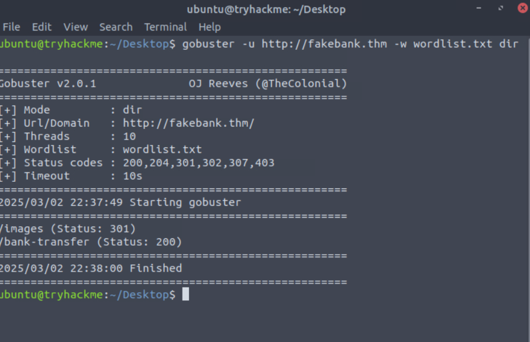
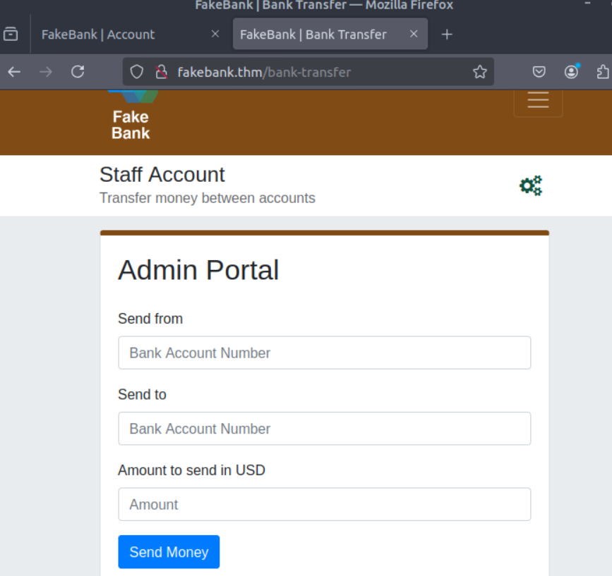
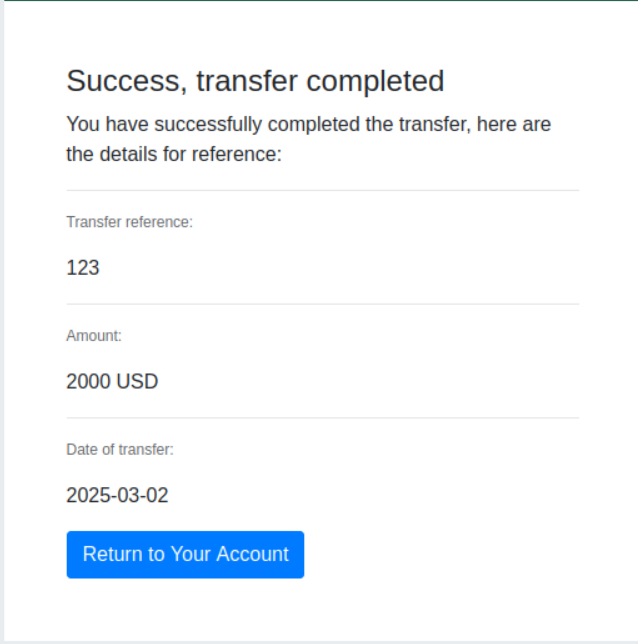
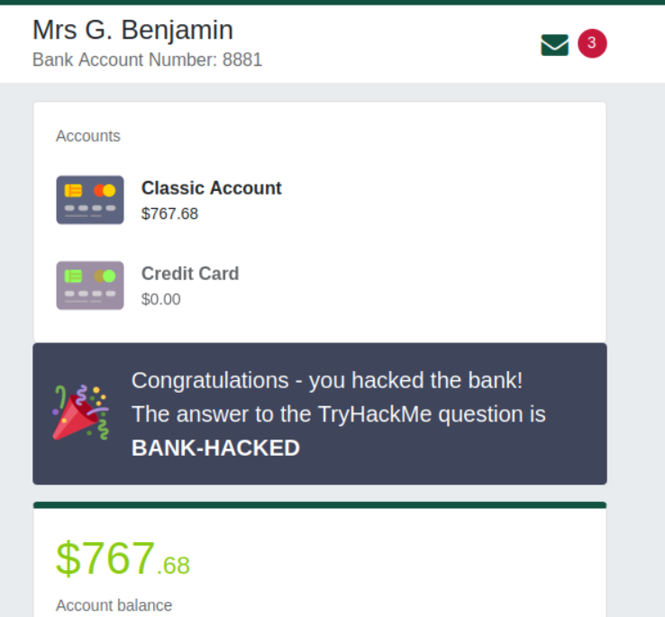

# Offensive Security Intro

This room is part of the **Introduction to Cyber Security** module available under the Pre-Security path.

You can access the room here: <a href="https://tryhackme.com/room/offensivesecurityintro">Offensive Security Intro</a>

## Task 1 - What is Offensive Security?

Offensive Security involves breaking into computer systems, exploiting software bugs, and finding loopholes in applications to gain unauthorized access.

Q.) Which of the following options better represents the process where you simulate a hacker's actions to find vulnerabilities in a system?

A.) **Offensive Security**

## Task 2 - Hacking your first machine

In the virtual machine provided for us we can see a fake bank application called FakeBank with an account.

Today we will be using a command-line application called "Gobuster" to brute-force FakeBank's website to find hidden pages. Gobuster will take a list of names and try accessing the website with each of them.

* Open the terminal
* Run the following command in the terminal:
  `gobuster -u http://fakebank.thm -w wordlist.txt dir`

* In the command **"-u"** is used to state the website we're scanning and **"-w"** takes a list of words to iterate through to find hidden pages.
* In this case we have a text document filled with words called **"wordlist.txt"**.
* Once the process is finished you have the following results:

* Gobuster gives us the pages in the directory format with a (Status: 200 message).
* As you can see, we have a hidden page **(/bank-transfer)**. Let us navigate to that page by entering the hidden page into our browser.
* This gives us access to a staff account, which allows us to transfer money to our account.

* Now, let us transfer $2000 from bank account 2276 to our account 8881.

* Now, when we check our bank account, we can see that our balance has been updated.

Q.) Above you account balance, you should now see a message indicating the answer to this question. Can you find the answer you need?

A.) **BANK-HACKED**
