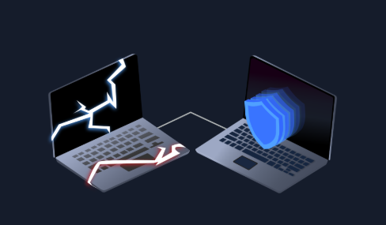

# Introduction to Cyber Security

Understand what is offensive and defensive security, and learn about careers available in cyber.

Explore both offensive and defensive security. Start by learning basic offensive security concepts, where you will hack a vulnerable online-banking application. Get exposure to defensive security and protect a system by blocking an ongoing cyber attack. In this module, you will also learn about the different careers within cyber security.

There are 3 rooms in this module:
* Offensive Security Intro
* Defensive Security Intro
* Careers in Cyber
