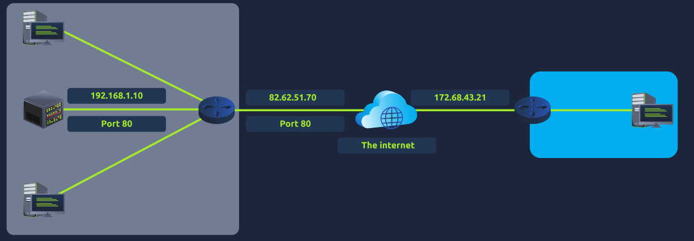
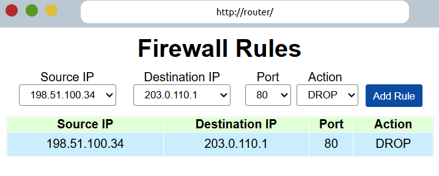
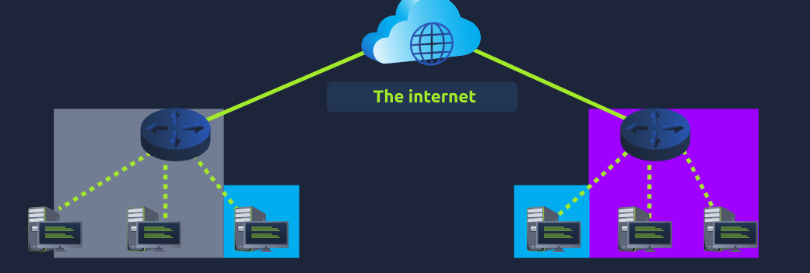
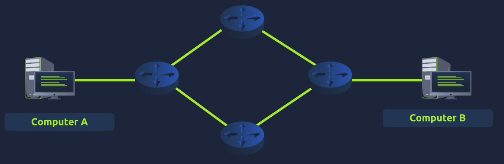
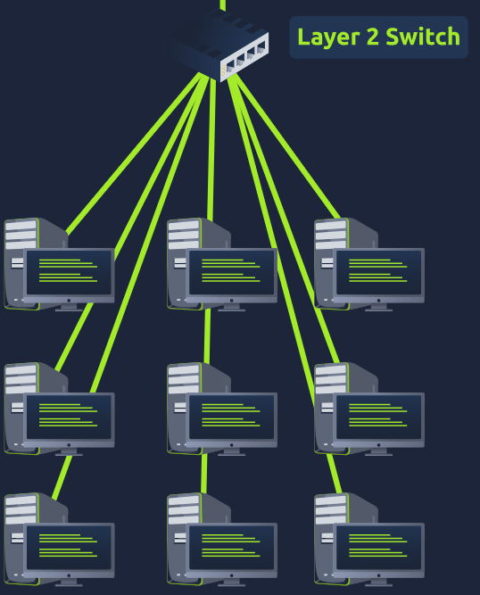
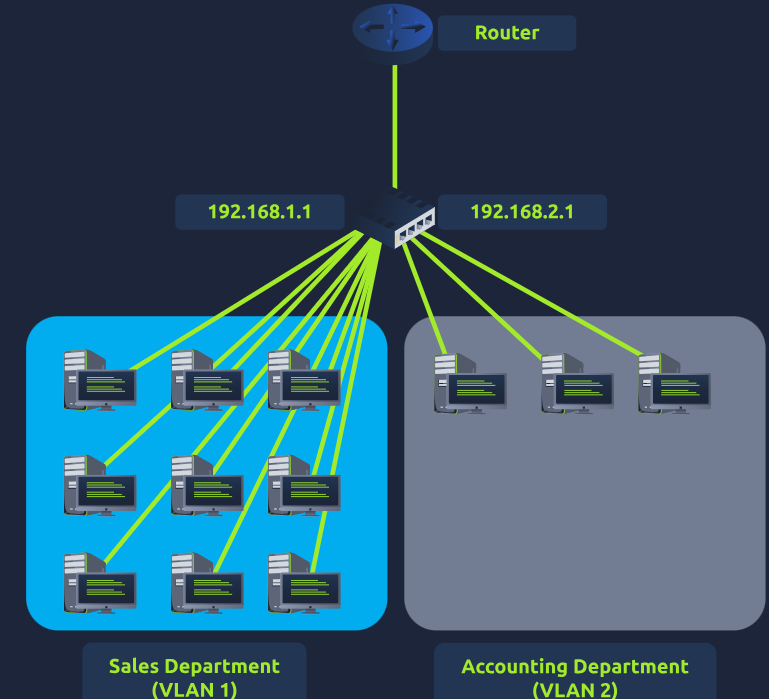
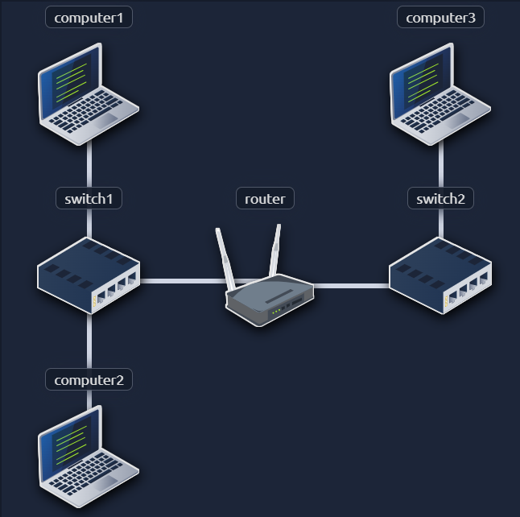
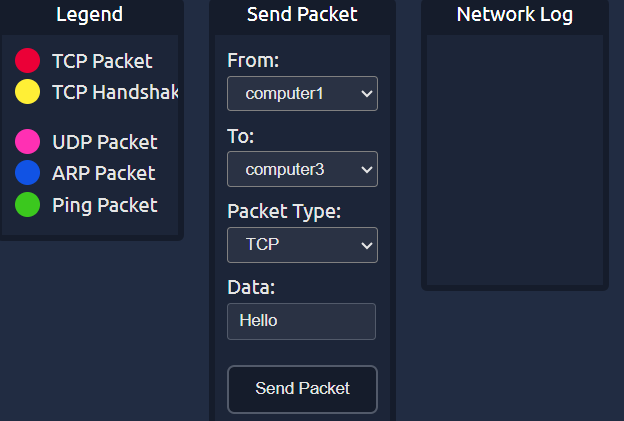
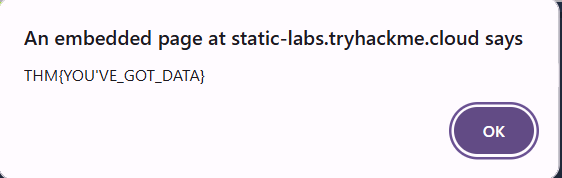

# Extending Your Network

This room is part of the **Network Fundamentals** module available under the Pre-Security path.

You can access the room here: <a href="https://tryhackme.com/room/extendingyournetwork">Extending Your Network</a>

## Task 1 - Introduction to Port Forwarding
* In a network, only the devices inside that network can access their server.
* For devices, port forwarding is required. This essentially assigns a public IP address for devices outside the network to access the internal server.
* Port forwarding is configured at the router of a network.

* In this design, the blue network will be able to access the server in the grey server using the public address (82.62.51.70)

Q.) What is the name of the device that is used to configure port forwarding?

A.) **Router**

## Task 2 - Firewalls 101
* A firewall is a device within a network responsible for determining what traffic is allowed to enter and exit.
* An administrator can configure a firewall to **permit or deny** traffic from entering or exiting a network based on numerous factors such as:-
  1. Where the traffic is coming from?
  2. Where is the traffic going to?
  3. What port is the traffic for?
  4. What protocol is the traffic using?
* Firewalls perform packet inspection to determine the answers to these questions.

### Stateful Firewalls
* This firewall uses the entire information from a connection, rather than inspecting an individual packet.
* This firewall determines the behavior of a device based upon the entire connection.
* If a connection from a host is bad, it will block the entire device.

### Stateless Firewalls
* This firewall uses a set of rules to determine whether or not individual packets are acceptable.
* A device sending a bad packet will not necessarily mean that the entire device is blocked.
* These firewalls are great when receiving large amounts of traffic

Q.) What layers of the OSI model do firewalls operate at?

A.) **Layer 3, Layer 4**

Q) What category of firewall inspects the entire connection?

A.) **stateful**

Q.) What category of firewall inspects individual packets?

A.) **stateless**

## Task 3 - Practical Firewall
* Configure the firewall to prevent the malicious packets from reaching the web server 203.0.110.1.
* Set the firewall such as this:

Q.) What is the flag?

A.) **THM{FIREWALLS_RULE}**

## Task 4 - VPN Basics
* A **Virtual** **Private** **Network** (or **VPN** for short) is a technology that allows devices on separate networks to communicate securely by creating a dedicated path between each other over the Internet (known as a tunnel).
* Devices connected within this tunnel form their own private network.

* Network #1 is the grey network and Network #2 is the purple network, while the 2 blue devices are connected by a VPN.
* The devices are still a part of Networks #1 and #2 respectively, but also form together a private network.
* Only devices connected via this VPN can communicate with these devices.
* Benefits:-
  1. Allows networks in different geographical locations to be connected.
  2. Offers privacy
  3. Offers anonymity
* VPN Technologies:-
  1. **Point-to-Point Tunneling Protocol (PPTP)** - Technology that allows the data from PPP to travel and leave a network. It is very easy to setup.
  2. **PPP** - Technology used by PPTP to allow for authentication and provide encryption of data.
  3. **Internet Protocol Security (IPSec)** - Encrypts the data using existing IP framework. It is difficult to setup, but boasts strong encryption.

Q.) What VPN technology only encrypts & provides the authentication of data?

A.) **PPP**

Q.) What VPN technology uses the IP framework?

A.) **IPSec**

## Task 5 - LAN Networking Devices

### Router
* It connects networks and pass data between them.
* Routing involves creating a path between networks so that this data can be successfully delivered.

### Switch
* A switch is a dedicated networking device responsible for providing a means of connecting to multiple devices.
* Switches can operate at both layer 2 and layer 3 of the OSI model.
* Layer 2 switches will forward frames onto the connected devices using their MAC address.

* Layer 3 switches are more sophisticated than layer 2, as they can perform some of the responsibilities of a router. Namely, these switches will send frames to devices and route packets to other devices using the IP protocol.

### VLAN - Virtual Local Area Network
* A technology called **VLAN** allows specific devices within a network to be virtually split up.
* This split means they can all benefit from things such as an Internet connection but are treated separately.
* This network separation provides security because it means that rules in place determine how specific devices communicate with each other.

Q.) What is the verb for the action that a router does?

A.) **Routing**

Q.) What are the two different layers of switches?

A.) **Layer 2, Layer 3**

## Task 6 - Practical Network Simulator
* This is a network simulator.

* Send a TCP packet from computer1 to computer3 to reveal a flag.
* You can do that by setting the conditions as:

* This starts the process and you can see the process happens.
* Once it finishes you will receive the flag:

### Network Logs
1. **HANDSHAKE**: Starting TCP/IP Handshake between computer1 and computer3
2. **HANDSHAKE**: Sending SYN Packet from computer1 to computer3
3. **ROUTING**: computer1 says computer3 is not on my local network sending to gateway: router
4. **ARP** **REQUEST**: Who has router tell computer1
5. **ARP** **RESPONSE**: Hey computer1, I am router
6. **ARP** **REQUEST**: Who has computer3 tell router
7. **ARP** **RESPONSE**: Hey router, I am computer3
8. **HANDSHAKE**: computer3 received SYN Packet from computer1, sending SYN/ACK Packet to computer1
9. **HANDSHAKE**: computer1 received SYN/ACK Packet from computer3, sending ACK packet to computer3
10. **HANDSHAKE**: computer3 received ACK packet from computer1, Handshake Complete
11. **TCP**: Sending TCP packet from computer1 to computer3
12. **TCP**: computer3 received TCP Packet from computer1, sending ACK Packet to computer1

Q.) What is the flag from the network simulator?

A.) **THM{YOU'VE_GOT_DATA}**

Q.) How many HANDSHAKE entries are there in the Network Log?

A.) **5**
