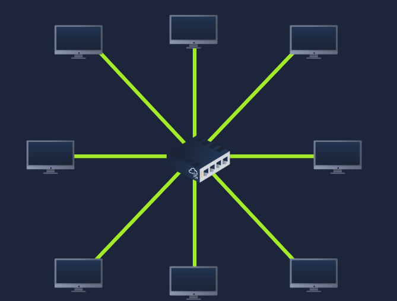
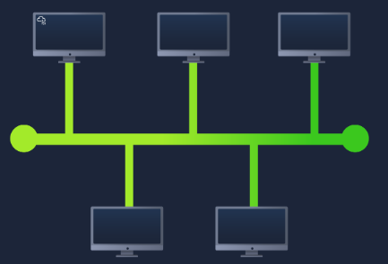
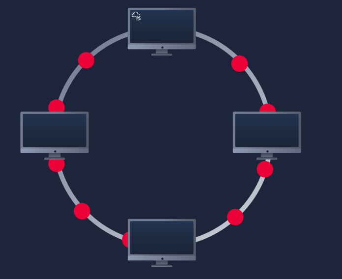
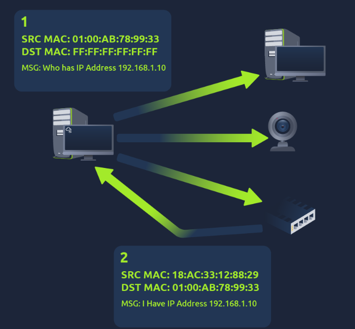
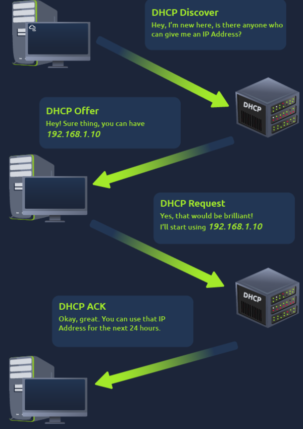

# Intro to LAN

This room is part of the **Network Fundamentals** module available under the Pre-Security path.

You can access the room here: <a href="https://tryhackme.com/room/introtolan">Intro to LAN</a>

## Task 1 - Introducing LAN Topologies
LAN stands for Local Area Network.

Topology, in reference to networking means the design of the network.

### Star Topology
* Devices are individually connected via a central networking device such as a switch.
* This topology requires a lot of cabling and purchase of dedicated networking equipment, so it is more expensive.
* Despite the added cost, this topology is much more scalable, which means it is very easy to add more devices.
* Unfortunately, the more the network scales, more maintenance is required to keep the network functional.
* If the centralized hardware that connects the devices fails, these devices will no longer be able to send or receive data.

### Bus Topology
* This connection relies upon a single connection which is known as a backbone cable.
* Since all the data travels along the same cable, it is very quickly prone to becoming slow and bottlenecked if all devices are simultaneously requesting data.
* However, bus topologies are one of the easier and cost-efficient topologies to set up.
* Another disadvantage is that, if the cable breaks, all the devices can no longer receive or transmit data.

### Ring Topology
* Devices are connected directly to each other to form a loop, meaning there is little cabling required.
* A ring topology works by sending data across the loop until it reaches the destined device, using other devices along the loop to forward the data.
* A device will only send received data from another device in this topology if it does not have any to send itself.
* If the device happens to have data to send, it will send its own data first before sending data from another device.
* However, this is a double-edged sword because it isn't an efficient way of data travelling across a network.

### Switch
* Switches are dedicated devices within a network that are designed to aggregate multiple other devices such as computers.
* Switches can connect a large number of devices by having ports of 4, 8, 16, 24, 32, and 64 for devices to plug into.
* When a switch receive a packet, it just sends it to the intended target, thus reducing network traffic.

### Router
* Routers connect networks and pass data between them.
* Routing involves creating a path between networks so that this data can be successfully delivered.

Q.) What does LAN stand for?

A.) **Local Area Network**

Q.) What is the verb given to the job that routers perform?

A.) **Routing**

Q.) What device is used to centrally connect multiple devices on the local network and transmit data to the correct location?

A.) **Switch**

Q.) What topology is cost-efficient to set up?

A.) **Bus Topology**

Q.) What topology is expensive to set up and maintain?

A.) **Star Topology**

Q.) Complete the interactive lab attached to this task. What is the flag given at the end?

A.) **THM{TOPOLOGY_FLAWS}**

## Task 2 - A Primer on Subnetting
* Subnetting means splitting up a network into smaller, miniature networks within itself.
* Subnetting is achieved by splitting up the number of hosts that can fit within the network, represented by a subnet mask.
* Subnet mask is also represented by a number of 4 bytes (32 bits) just like an IP address.
* Subnets use IP addressed in 3 ways:-
  1. **Identify the network address** - Identifies the start of the actual network.
  2. **Identify the host address** - Identify the device on the subnet.
  3. **Identify the default gateway** - Special address assigned to device on a network that is capable of sending information to another network.
  * Let us take the example of a host device with IP 192.168.1.100-
    1. Network address - 192.168.1.0
    2. Host address - 192.168.1.100
    3. Default Gateway - 192.168.1.254

Q.) What is the technical term for dividing a network up into smaller pieces?

A.) **Subnetting**

Q.) How many bits are in a subnet mask?

A.) **32**

Q.) What is the range of a section (octet) of a subnet mask?

A.) **0–255**

Q.) What address is used to identify the start of a network?

A.) **Network Address**

Q.) What address is used to identify devices within a network?

A.) **Host Address**

Q.) What is the name used to identify the device responsible for sending data to another network?

A.) **Default Gateway**

## Task 3 - ARP
* **Address Resolution Protocol (ARP)** is the technology that is responsible for allowing devices to identify themselves on a network.
* Simply, **ARP** allows a device to associate its MAC address with an IP address.
* When devices wish to communicate with another, they will send a broadcast to the entire network searching for the specific device. Devices can use ARP to find the MAC address of a device for communication.
* Working:
  1. Every device on the network has a cache, which stores identifiers o other devices on the network.
  2. ARP sends a **ARP Request** message, which is broadcasted on the network asking, "What is the MAC address that owns this IP address?".
  3. When other devices receive this message, only the device with the correct IP address will respond with a **ARP Reply** message.
  4. The requesting device will now remember the mapping and store it in its **ARP cache** for future use.

Q.) What does ARP stand for?

A.) **Address Resolution Protocol**

Q.) What category of ARP packet asks a device whether or not it has a specific IP address?

A.) **Request**

Q.) What address is used as a physical identifier for a device on a network?

A.) **MAC Address**

Q.) What address is used as a logical identifier for a device on a network?

A.) **IP Address**

## Task 4 - DHCP
* IP addresses can be assigned either manually, by entering them physically into a device, or automatically by using a **DHCP (Dynamic Host Configuration Protocol)** server.
* When a device connects to a network, if it has not already been manually assigned an IP address, it sends out a **DHCP Discover** to see if any DHCP servers are on the network.
* The DHCP server then relies back with an IP address the device could use (**DHCP Offer**).
* The device then sends a reply confirming it wants the offered IP address (**DHCP Request**).
* Lastly, the DHCP servers sends a reply acknowledging this has been completed, and the device can start using the IP address (**DHCP ACK**).

Q.) What type of DHCP packet is used by a device to retrieve an IP address?

A.) **DHCP Discover**

Q.) What type of DHCP packet does a device send once it has been offered an IP address by the DHCP server?

A.) **DHCP Request**

Q.) Finally, what is the last DHCP packet that is sent to a device from a DHCP server?

A.) **DHCP ACK**
