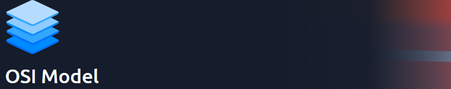
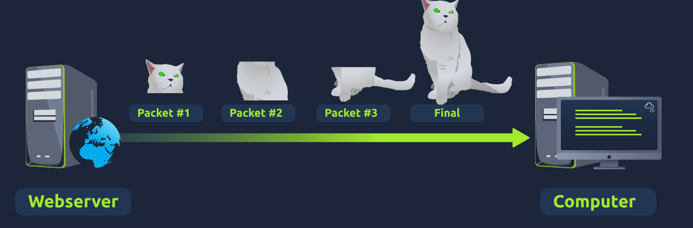
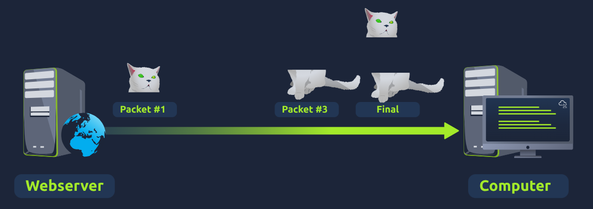

# OSI Model

This room is part of the **Network Fundamentals** module available under the Pre-Security path.

You can access the room here: <a href="https://tryhackme.com/room/osimodelzi">OSI Model</a>

## Task 1 - What is the OSI Model?
* The **OSI** model **(Open Systems Interconnection)** is an essential model which provides a framework dictating how all networked devices will send, receive and interpret data.
* The OSI model consists of 7 layers, where each layer has a different set of responsibilities.
* The Layers are:
  1. Layer 7 - Application
  2. Layer 6 - Presentation
  3. Layer 5 - Session
  4. Layer 4 - Transport
  5. Layer 3 - Network
  6. Layer 2 - Data Link
  7. Layer 1 - Physical
* At each individual layer the data travels through, specific processes take place and pieces of information are added to this data. This process is called **encapsulation**.

Q.) What does the "OSI" in "OSI Model" stand for?

A.) **Open Systems Interconnection**

Q.) How any layers (in digits) does the OSI model have?

A.) **7**

Q.) What is the key term for when pieces of information get added to data?

A.) **encapsulation**

## Task 2 - Layer 1 - Physical
* This layer references the physical components of the hardware used in networking and is the lowest layer that you will find.
* Devices use electrical signals to transfer data between each other in a binary numbering system (1's and 0's)

Q.) What is the name of this Layer?

A.) **Physical**

Q.) What is the name of the numbering system that is both 0's and 1's?

A.) **Binary**

Q.) What is the name of the cables that are used to connect devices?

A.) **Ethernet**

## Task 3 - Layer 2 - Data Link
* This layer focuses on the physical addressing of the transmission.
* It receives a packet from the Network layer and adds in the physical MAC address of the receiving endpoint. This MAC address is available in the **Network Interface Card (NIC)**.
* Additionally, it is also the job of the data link layer to present the data in a format suitable for transmission.

Q.) What is the name of this Layer?

A.) **Data Link**

Q.) What is the name of the piece of hardware that all networked devices come with?

A.) **Network Interface Card**

## Task 4 - Layer 3 - Network
* The third layer of the OSI model is where the routing and re-assembly of data takes place.
* Firstly, routing simply determines the most optimal path in which data should be sent.
* Two of the protocols which determine the optical path is **OSPF (Open Shortest Path First)** and **RIP (Routing Information Protocol)**.
* The factors that decide what route is taken are:-
  1. What path is the shortest?
  2. What path is the most reliable?
  3. Which path has the faster physical connection?

Q.) What is the name of this Layer?

A.) **Network**

Q.) Will packets take the most optimal route across a network? (Y/N)

A.) **Y**

Q.) What does the acronym "OSPF" stand for?

A.) **Open Shortest Path First**

Q.) What does the acronym "RIP" stand for?

A.) **Routing Information Protocol**

Q.) What type of addresses are dealt with at this layer?

A.) **IP Addresses**

## Task 5 - Layer 4 - Transport
* This layer of the OSI model plays a vital part in transmitting data across a network.
* When data is sent between devices, it follows one of 2 different protocols:
  1. Transmission Control Protocol (TCP)
  2. User Datagram Protocol (UDP)

### Transmission Control Protocol
* This protocol reserves a constant connection between the 2 devices for the amount of time it takes for the data to be sent and received.
* TCP also incorporates error checking, which guarantees that data sent from small chunks in the session layer has been received and reassembled in the same order.
* Advantages:-
  1. Guarantees accuracy of data
  2. Synchronizes two devices to prevent each other from being flooded with data.
  3. More processes for reliability.
* Disadvantages:-
  1. Requires a reliable connection between 2 devices.
  2. Slow connection can bottleneck another device.
  3. Significantly slower than UDP.
* TCP is used for situations such as file sharing, internet browsing or sending an email.

### User Datagram Protocol
* This protocol is not nearly advanced as TCP.
* It does not error checking or reliability and any data that is sent via UDP is sent to the device whether it gets there or not.
* Advantages:-
  1. Much faster than TCP.
  2. Does not reserve a continuous connection on a device.
* Disadvantages:-
  1. UDP doesn't care if the data is received.
  2. Unstable connections result in a terrible experience for the user.

Q.) What is the name of this Layer?

A.) **Transport**

Q.) What does TCP stand for?

A.) **Transmission Control Protocol**

Q.) What does UDP stand for?

A.) **User Datagram Protocol**

Q.) What protocol guarantees the accuracy of data?

A.) **TCP**

Q.) What protocol doesn't care if data is received or not by the other device?

A.) **UDP**

Q.) What protocol would an application such as an email client use?

A.) **TCP**

Q.) What protocol would an application that downloads files use?

A.) **TCP**

Q.) What protocol would an application that streams video use?

A.) **UDP**

## Task 6 - Layer 5 - Session
* Once the data has been correctly translated or formatted from the presentation layer, the session layer will begin to create and maintain the connection to other device for which the data is destined.
* When a connection is established, a session is created. Whilst this connection is active, so is the session.
* The session layer is also responsible for closing the connection if it hasn't been used in a while.
* Additionally, a session can contain checkpoints, where if the data is lost, only the newest pieces of data are required to be sent.

Q.) What is the name of this layer?

A.) **Session**

Q.) What is the technical term for when a connection is successfully established?

A.) **Session**

## Task 7 - Layer 6 - Presentation
* This layer acts a translator for data to and from the application layer.
* The receiving computer will also understand data sent to a computer in one format destined for in another format.
* Security features such as data encryption occur at this layer.

Q.) What is the name of this Layer?

A.) **Presentation**

Q.) What is the main purpose that this Layer acts as?

A.) **Translator**

## Task 8 - Layer 7 - Application
* The application layer is the layer in which protocols and rules are in place to determine how the user should interact with data sent or received.
* All applications provide a friendly, **Graphical User Interface (GUI)** for users to interact with data sent or received.
* Other protocols include **DNS (Domain Name System)**, which is how website addresses are translated into IP addresses.
* 
Q.) What is the name of this Layer?

A.) **Application**

Q.) What is the technical term that is given to the name of the software that users interact with?

A.) **Graphical User Interface**

## Task 9 - OSI Game
* Climb the levels in the correct order to escape the dungeon and reveal the flag!

Q.) Escape the dungeon to retrieve the flag. What is the flag?

A.) **THM{OSI_DUNGEON_ESCAPED}**
