# Packets & Frames

This room is part of the **Network Fundamentals** module available under the Pre-Security path.

You can access the room here: <a href="https://tryhackme.com/room/packetsframes">Packets & Frames</a>

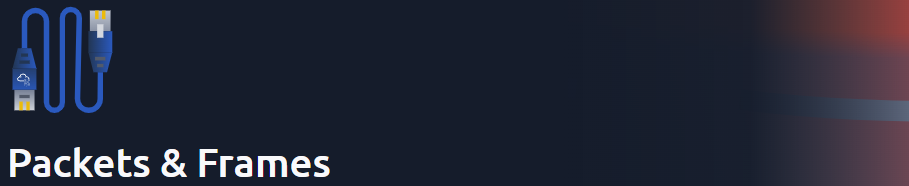

## Task 1 - What are Packets and Frames
* Packets and frames are small pieces of data that, when forming together, make a larger piece of information and message.
* **Frame** is the envelope in which packets are stored and sent across a network
* **Packets** are an efficient way of communicating data across networks.
* Any data sent over the network is split into small pieces and reconstructed once it reaches the target.
* Every packet which uses **Internet Protocol** will have a set of headers that contain additional pieces of information. Some of the are:-
  1. **Time to Live**: Expiry timer for the packet
  2. **Checksum**: Integrity checking for packets
  3. **Source Address**: IP address of the packet sender
  4. **Destination Address**: IP address of the packet receiver

Q.) What is the name for a piece of data when it does have IP addressing information?

A.) **Packet**

Q.) What is the name for a piece of data when it does not have IP addressing information?

A.) **Frame**

## Task 2 - TCP/IP (The Three-Way Handshake)
* TCP/IP protocol is one of the rules used in networking.
* Similar to the OSI model, TCP/IP protocol consists of 4 layers:-
  1. Application
  2. Transport
  3. Internet
  4. Network Interface
* The main defining feature of TCP is that it is **connection-based**, which means that TCP must establish a connection between both a client and a device.
* TCP packets contain various sections of information with headers:-
  1. **Source Port**: Port opened by sender to send TCP packet
  2. **Destination Port**: Port number that the receiving application is running.
  3. **Source IP**: IP address of device that is sending the packet
  4. **Destination IP**: IP address of the device that the packet is destined for.
  5. **Sequence Number**: When a connection occurs, the first piece of data is given a random number.
  6. **Acknowledgement Number**: The second piece of data will have a number of sequence number +1
  7. **Checksum**: The integrity checker for the packet.
  8. **Data**: The data is stored here
  9. **Flag**: This header determines how the packet should be handled during the handshake process.
### Three-way Handshake
* The process used to establish a connection between 2 devices.
* It has some special messages:-
  1. **SYN** - Used to initiate a connection and synchronize the 2 devices.
  2. **SYN/ACK** - Sent by receiving device to acknowledge the synchronization attempt.
  3. **ACK** - Used by sender/receiver to acknowledgement packets have been successfully received.
  4. **DATA** - Once a connection is established, data is sent via this message.
  5. **FIN** - This is used to cleanly close the connection after it has been complete.
  6. **RST** - This packet abruptly ends all communication.

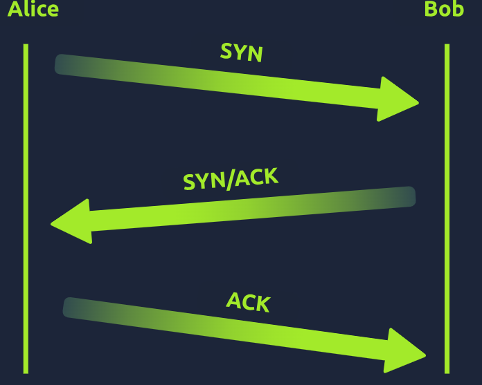

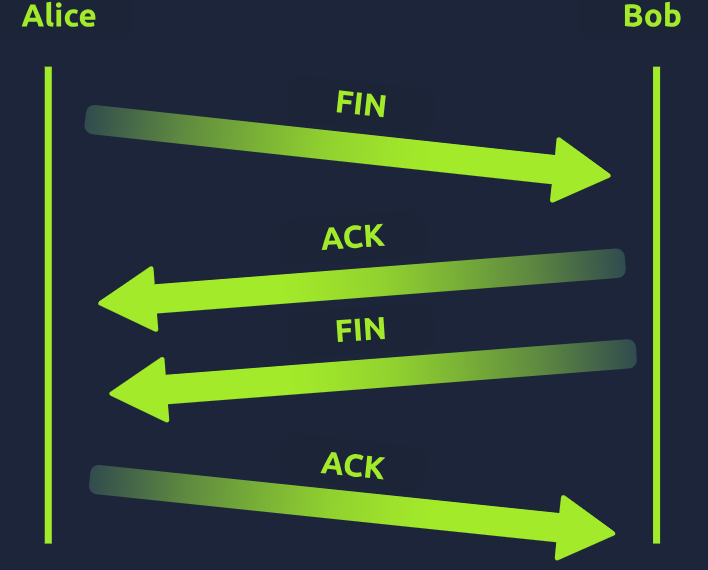

Q.) What is the header in a TCP packet that ensures the integrity of data?

A.) **checksum**

Q.) Provide the order of a normal Three-way handshake (with each step separated by a comma)

A.) **SYN, SYN/ACK, ACK**

## Task 3 - Practical Handshake
* Let us try to communicate by following the TCP handshake process

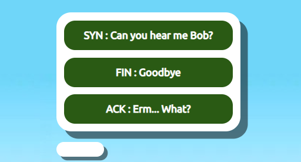

* First, we have to send a **SYN message**, so choose that option.

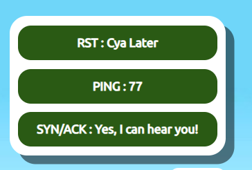

* We need to respond to that with a **SYN/ACK message**.

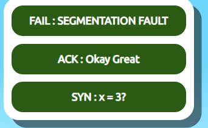

* Let's respond to that with a **ACK message**.

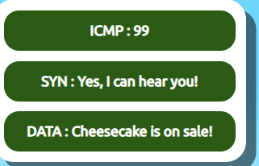

* Since the connection is setup, we can start sending **DATA messages**.

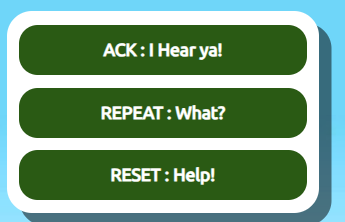

* We respond to that with a **ACK message**.

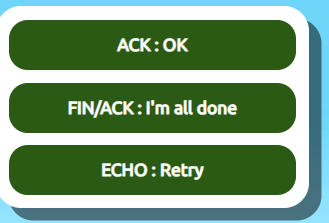

* The data is sent, so we know begin to close the connection with a **FIN/ACK message**.

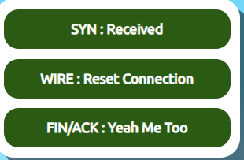

* The receiver also sends a **FIN/ACK message**.

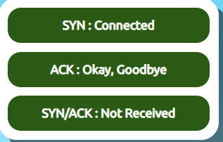

* Finally, the sender sends as **ACK message** closing the connection.
* With this, we receive the flag.

Q.) What is the value of the flag given at the end of the conversation?

A.) **THM{TCP_CHATTER}**

## Task 4 - UDP/IP
* The User Datagram Protocol is another protocol that is used to communicate data between devices.
* Unlike TCP, UDP is a **stateless** protocol that doesn't require a constant connection between the 2 devices for data to be sent.
* For this reason, there is no three-way handshake that takes place in UDP.
* Let us look at some headers:-
  1. **Time to Live (TTL)** - This sets an expiry timer for the packet.
  2. **Source Address** - IP address of the device that sends the packet.
  3. **Destination Address** - IP address of the device receiving the packet.
  4. **Source Port** - Port number opened by sender to send the UDP packet.
  5. **Destination Port** - Port number receiving application is running on.
  6. **Data** - The transmitted data is stored.

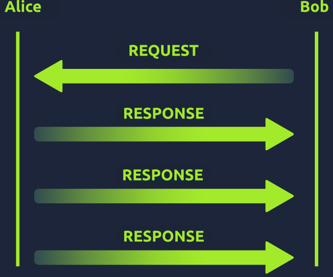

Q.) What does the term "UDP" stand for?

A.) **User Datagram Protocol**

Q.) What type of connection is "UDP"?

A.) **stateless**

Q.) What protocol would you use to transfer a file?

A.) **TCP**

Q.) What protocol would you use to have a video call?

A.) **UDP**

## Task 5 - Ports 101
* Ports are an essential place where data cab be exchanged.
* Network devices use ports to enforce strict rules when communicating with one another.
* In computing, ports are a numerical value between **0 and 65535**.
* Since  there are so many, there is risk of losing track of all of them.
* For that reason, some ports are specifically used by specific applications.
* Some of them are:-
  1. **File Transfer Protocol (FTP)** - Port 21 - This protocol is used for file sharing.
  2. **Secure Shell (SSH)** - Port 22 - This protocol is used to securely login in to systems via text-based interface.
  3. **HyperText Transfer Protocol (HTTP)** - Port 80 - This protocol powers the World Wide Web
  4. **HyperText Transfer Protocol Secure (HTTPS)** - Port 443 - This protocol works exactly as HTTP, except it has encryption.
  5. **Server Message Block (SMB)** - Port 445 - This protocol works like FTP but allows you to share devices too.
  6. **Remote Desktop Protocol (RDP)** - Port 3389 - This protocol is used to securely login in to systems using a visual desktop interface.

* Now, let us work on the practical challenge

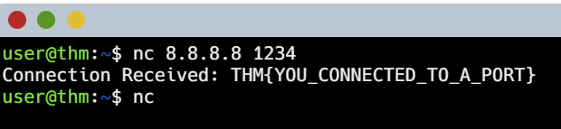

Q.) What is the flag received from the challenge?

A.) **THM(YOU_CONNECTED_TO_A_PORT}**
