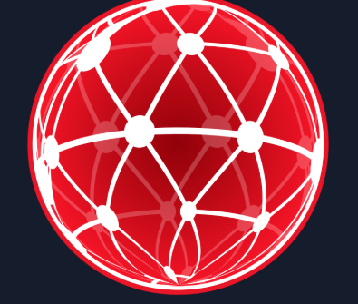

# Network Fundamentals

Learn the core concepts of how computers communicate with each other and types of network weaknesses.

Every security professional needs to understand the network fundamentals. This module will introduce the core concepts of computer networking, covering everything from the Internet Protocol (IP), network topologies, TCP and UDP protocols of the OSI Transport Layer. Don’t worry if that sounds complicated, as this modules labs uses fun beginner friendly exercises and real-world examples to help guide your learning.

There are 5 rooms in this module:
 1. <a href="https://github.com/sai-kantamuneni/TryHackMe-Walkthroughs/tree/main/Pre-Security/Network%20Fundamentals/What%20is%20Networking">What is Networking?</a>
 2. <a href="https://github.com/sai-kantamuneni/TryHackMe-Walkthroughs/tree/main/Pre-Security/Network%20Fundamentals/Intro%20to%20LAN">Intro to LAN</a>
 3. <a href="https://github.com/sai-kantamuneni/TryHackMe-Walkthroughs/tree/main/Pre-Security/Network%20Fundamentals/OSI%20Model">OSI Model</a>
 4. <a href="">Packets & Frames</a>
 5. <a href="">Extending Your Network</a>
