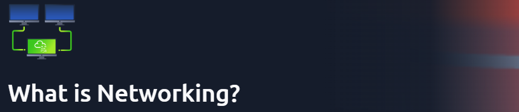
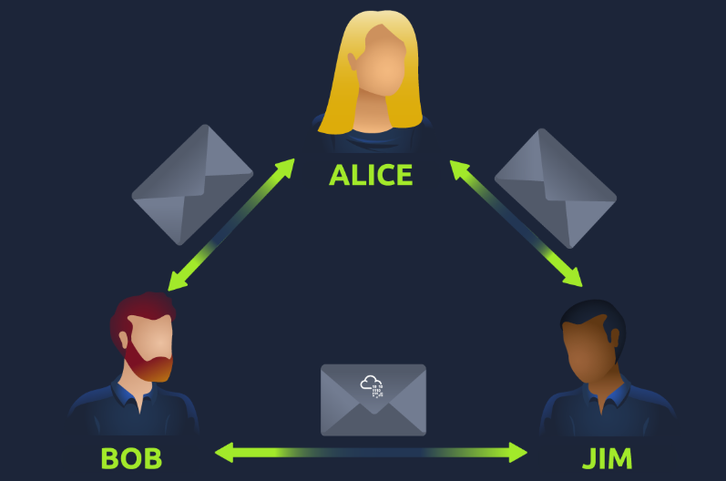
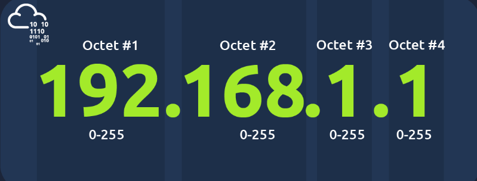

# What is Networking?

This room is part of the **Network Fundamentals** module available under the Pre-Security path.

You can access the room here: <a href="https://tryhackme.com/room/whatisnetworking">What is Networking?</a>

## Task 1 - What is Networking?
Networks are simply things **connected**.

In computing, a network can be formed by anywhere from 2 devices to billions. These devices include everything from your laptop and phone to security cameras, traffic lights and even farming!

Networks come in all shapes and sizes.

Q.) What is the key term for devices that are connected together?

A.) **Network**

## Task 2 - What is the Internet?
The Internet is one giant network that consists of many, many small networks within itself.

The first iteration of the Internet was within the ARPANET project in the late 1960s. This project was funded by the United States Defense Department and was the first documented network in action.

However, it wasn't until 1989 when the Internet as we know it was invented by Tim Berners-Lee by the creation of the **World Wide Web (WWW)**.

Q.) Who invented the World wide Web?

A.) **Tim Berners-Lee**

## Task 3 - Identifying Devices on a Network
Devices have 2 ways of identification:
* An Internet Protocol (IP) Address
* A Media Access Control (MAC) Address

### IP Addresses
* An **IP address (or Internet Protocol)** address can be used as a way of identifying a host on a network for a period of time.

* An **IP address** is a set of numbers that are divided into four octets. The value of each octet will summarize to be the IP address of the device on the network. This number is calculated through a technique known as IP addressing & subnetting.

* IP addresses can change from device to device but cannot be active simultaneously more than once within the same network.

* IP Addresses follow a set of standards known as protocols. These protocols are the backbone of networking and force many devices to communicate in the same language.

* A public address is used to identify the device on the Internet, whereas a private address is used to identify a device amongst other devices.

* As more and more devices become connected, it is becoming increasingly harder to get a public address that isn't already in use. Enter IP Address versions.

* The first version is IPv4, which uses a numbering system of 2³² IP addresses (4.29 billion) - which are running out.

* IPv6 is a new iteration of the Internet Protocol addressing scheme to help tackle this issue:
  1. Supports up to 2¹²⁸ of IP addresses (340 trillion-plus), resolving the issues faced with IPv4.
  2. More efficient due to new methodologies

### MAC Addresses
* Devices on a network will all have a physical network interface, which is a microchip board found on the device's motherboard. This network interface is assigned a unique address at the factory it was built at, called a **MAC (Media Access Control)** address.
* The MAC address is a **twelve-character** hexadecimal number (_a base sixteen numbering system used in computing to represent numbers_) split into two's and separated by a colon. These colons are considered separators.

* The first six characters represent the company that made the network interface, and the last six is a unique number.

* MAC addresses is that they can be faked or "spoofed" in a process known as spoofing.

* This spoofing occurs when a networked device pretends to identify as another using its MAC address. When this occurs, it can often break poorly implemented security designs that assume that devices talking on a network are trustworthy.

Q.) What does the term "IP" stand for?

A.) **Internet Protocol**

Q.) What is each section of an IP address called?

A.) **Octet**

Q.) How many sections (in digits) does an IPv4 address have?

A.) **4**

Q.) What does the term "MAC" stand for?

A.) **Media Access Control**

Q.) Deploy the interactive lab using the "View Site" button and spoof your MAC address to access the site. What is the flag?

A.) **THM{YOU_GOT_ON_TRYHACKME}**

## Task 4 - Ping (ICMP)
* Ping is one of the most fundamental network tools available to us. Ping uses **ICMP (Internet Control Message Protocol)** packets to determine the performance of a connection between devices, for example, if the connection exists or is reliable.
* The time taken for ICMP packets travelling between devices is measured by ping. This measuring is done using ICMP's echo packet and then ICMP's echo reply from the target device.
* Pings can be performed against devices on a network, such as your home network or resources like websites.

Q.) What protocol does ping use?

A.) **ICMP**

Q.) What is the syntax to ping 10.10.10.10?

A.) **ping 10.10.10.10**

Q.) What flag do you get ping 8.8.8.8?

A.) **THM{I_PINGED_THE SERVER}**

